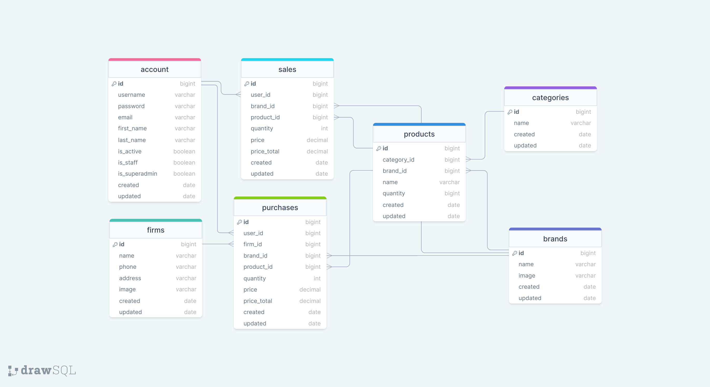

# 📊 Stock Management API

A full-stack stock management system with user authentication, role-based access control, and comprehensive inventory management.

## 🌐 Deployment Link

[View Live Application](https://fullstack-stockapp-outp.onrender.com/)

---

## 📚 Database Schema

### ERD Diagram (camelCase)


### ERD Diagram (snake_case)



---

## 🛠️ Tech Stack

- **Backend:** Node.js, Express.js
- **Database:** MongoDB with Mongoose
- **Authentication:** JWT Tokens
- **Documentation:** Swagger/OpenAPI
- **Frontend:** React (build deployment to `/public`)
- **Email Service:** nodemailer (password reset functionality)

---

## 📁 Project Structure

```
.
├── .env
├── .gitignore
├── index.js
├── package.json
├── readme.md
├── erdStockAPI.png
├── erdStockAPI2.png
├── public/                 # Frontend build (production)
├── src/
│   ├── config/
│   │   ├── dbConnection.js
│   │   └── swagger.json
│   ├── controllers/        # Business logic
│   │   ├── auth.js
│   │   ├── brand.js
│   │   ├── category.js
│   │   ├── firm.js
│   │   ├── product.js
│   │   ├── purchase.js
│   │   ├── sale.js
│   │   ├── token.js
│   │   └── user.js
│   ├── helpers/
│   │   ├── passwordEncrypt.js
│   │   └── sendMail.js
│   ├── middlewares/        # Express middleware
│   │   ├── authentication.js
│   │   ├── errorHandler.js
│   │   ├── findSearchSortPage.js
│   │   ├── logger.js
│   │   ├── permissions.js
│   │   └── upload.js
│   ├── models/             # MongoDB schemas
│   │   ├── brand.js
│   │   ├── category.js
│   │   ├── DeleteRequest.js
│   │   ├── firm.js
│   │   ├── product.js
│   │   ├── purchase.js
│   │   ├── sale.js
│   │   ├── token.js
│   │   └── user.js
│   └── routes/
│       ├── auth.js
│       ├── brand.js
│       ├── category.js
│       ├── document.js
│       ├── firm.js
│       ├── index.js
│       ├── product.js
│       ├── purchase.js
│       ├── sale.js
│       ├── token.js
│       └── user.js
└── client/                 # React frontend
    ├── public/
    ├── src/
    ├── package.json
    └── build/
```

---

## 🚀 Installation & Setup

### Prerequisites

- Node.js (v14+)
- MongoDB
- npm or yarn

### Backend Setup

```bash
# Clone repository
git clone https://github.com/kapucuonur/FullStack_StockApp.git
cd FullStack_StockApp

# Install dependencies
npm install

# Setup environment variables
cp .env.example .env
# Edit .env with your MongoDB URI, JWT secret, email credentials, etc.

# Run development server
npm run dev

# Production setup (frontend + backend)
npm run setup-production
```

### Environment Variables (.env)

```
MONGODB_URI=your_mongodb_connection_string
JWT_SECRET=your_jwt_secret_key
JWT_EXPIRE=7d
NODEMAILER_USER=your_email@gmail.com
NODEMAILER_PASS=your_app_password
PORT=8000
NODE_ENV=development
```

---

## 📖 API Documentation

Once the server is running, visit:

- **Swagger UI:** `/api/v1/documents/swagger`
- **ReDoc:** `/api/v1/documents/redoc`
- **OpenAPI JSON:** `/api/v1/documents/json`

### Base URL

```
http://localhost:8000/api/v1
```

---

## 👥 User Management Features

### Role-Based Access Control

**Admin** can:

- View all users
- View own information
- Edit own information
- Edit other users
- Delete users
- Manage staff permissions
- Request account deletion

**Staff** can:

- View own information
- Edit own information
- Request account deletion

**Regular Users** can:

- View own information
- Edit own information
- Request account deletion

### User Registration Rules

- First user created becomes **Admin** (isAdmin flag ignored in request)
- Subsequent users default to **regular users** (isAdmin: true is stripped)
- **Staff** can only be assigned by **Admin**
- Users cannot delete their own accounts; they must submit a deletion request

### Account Deletion Request

Users can request account deletion:

```bash
POST /api/v1/users/request-delete
Content-Type: application/json

{
  "reason": "No longer needed"
}
```

**Admin** can approve/reject deletion requests:

```bash
POST /api/v1/admin/users/delete-request/:requestId
Content-Type: application/json

{
  "status": "Approved"  // or "Rejected"
}
```

---

## 🔐 Authentication & Security

- JWT token-based authentication
- Password encryption with bcrypt
- Email verification for password reset
- Role-based middleware for protected routes
- Secure password change with email confirmation
- Admin can restrict user access without password change

---

## 📦 API Endpoints

### Authentication

- `POST /api/v1/auth/register` - Register new user
- `POST /api/v1/auth/login` - Login user
- `POST /api/v1/auth/logout` - Logout user
- `POST /api/v1/auth/refresh` - Refresh JWT token

### Users

- `GET /api/v1/users` - Get users (filtered by role)
- `GET /api/v1/users/:id` - Get user by ID
- `PUT /api/v1/users/:id` - Update user
- `DELETE /api/v1/users/:id` - Delete user (admin only)
- `POST /api/v1/users/request-delete` - Request account deletion
- `GET /api/v1/admin/delete-requests` - View deletion requests (admin only)
- `POST /api/v1/admin/delete-request/:id/approve` - Approve deletion (admin only)
- `POST /api/v1/admin/delete-request/:id/reject` - Reject deletion (admin only)

### Products, Brands, Categories, Firms, Purchases, Sales

- Standard CRUD operations with filtering, sorting, and pagination

---

## 🎯 Key Features

✅ Complete inventory management system  
✅ Role-based access control (Admin, Staff, User)  
✅ JWT authentication with refresh tokens  
✅ Email notifications for password reset  
✅ Account deletion requests workflow  
✅ Search, filter, sort, and pagination  
✅ Swagger API documentation  
✅ Error handling middleware  
✅ Request logging  
✅ File upload support

---

## 🔄 Development Workflow

### Run Development Server

```bash
npm run dev
```

### Generate Swagger Documentation

```bash
node swaggerAutogen
```

### Build for Production

```bash
npm run setup-production
```

This command:

1. Installs backend dependencies
2. Generates Swagger docs
3. Installs frontend dependencies
4. Builds React app
5. Moves build to `/public` folder

---

## 📝 Notes for Frontend Integration

Update `client/.env` or API configuration:

```javascript
const baseURL = "/api/v1";
```

Build script in `package.json`:

```json
{
  "build": "react-scripts build",
  "rename": "mv build ../public",
  "rename1": "mkdir -p ../public && mv build/* ../public/"
}
```

### Backend Configuration (index.js)

```javascript
const path = require("node:path");

// Serve static files from public folder
app.use(express.static(path.resolve(__dirname, "./public")));

// Welcome endpoint
app.all("/api/v1", (req, res) => {
  res.send({
    error: false,
    message: "Welcome to Stock Management API",
    documents: {
      swagger: "/api/v1/documents/swagger",
      redoc: "/api/v1/documents/redoc",
      json: "/api/v1/documents/json",
    },
    user: req.user,
  });
});

// API routes
app.use("/api/v1", require("./src/routes"));

// Serve React frontend
app.get("/", (req, res) => {
  res.sendFile(path.resolve(__dirname, "./public", "index.html"));
});
```

### Package.json Scripts

```json
{
  "scripts": {
    "start": "node index.js",
    "dev": "nodemon index.js",
    "build": "npm run setup-production",
    "setup-production": "npm i && node swaggerAutogen && cd client && npm i && npm run build && npm run rename1"
  }
}
```

---

## 🤝 Contributing

1. Create a feature branch (`git checkout -b feature/AmazingFeature`)
2. Commit changes (`git commit -m 'Add AmazingFeature'`)
3. Push to branch (`git push origin feature/AmazingFeature`)
4. Open a Pull Request

---

## 📄 License

This project is licensed under the MIT License - see the LICENSE file for details.

---

## 👨‍💻 Author

**Onur Kapucu**  
GitHub: [@kapucuonur](https://github.com/kapucuonur)

---

## 📞 Support

For issues and feature requests, please use the [GitHub Issues](https://github.com/kapucuonur/FullStack_StockApp/issues) page.

---
